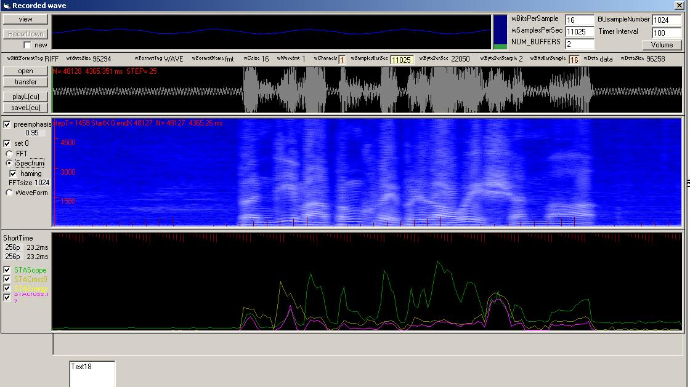

<div align="center">

## wave api recorder and fft/Spectrum etc


</div>

### Description

wave api recorder and fft Spectrum etc

a speech data interface vb6

it run in vb6 ide (or p-code) is ok , run in native code always crash. some free code is download from internet.
 
### More Info
 


<span>             |<span>
---                |---
**Submitted On**   |2008-04-23 16:45:08
**By**             |[wswtt](https://github.com/Planet-Source-Code/PSCIndex/blob/master/ByAuthor/wswtt.md)
**Level**          |Advanced
**User Rating**    |5.0 (15 globes from 3 users)
**Compatibility**  |VB 6\.0
**Category**       |[Windows API Call/ Explanation](https://github.com/Planet-Source-Code/PSCIndex/blob/master/ByCategory/windows-api-call-explanation__1-39.md)
**World**          |[Visual Basic](https://github.com/Planet-Source-Code/PSCIndex/blob/master/ByWorld/visual-basic.md)
**Archive File**   |[wave\_api\_r2110594232008\.zip](https://github.com/Planet-Source-Code/wswtt-wave-api-recorder-and-fft-spectrum-etc__1-70452/archive/master.zip)

### API Declarations

```
waveinopen
wave***
copymemory
```


